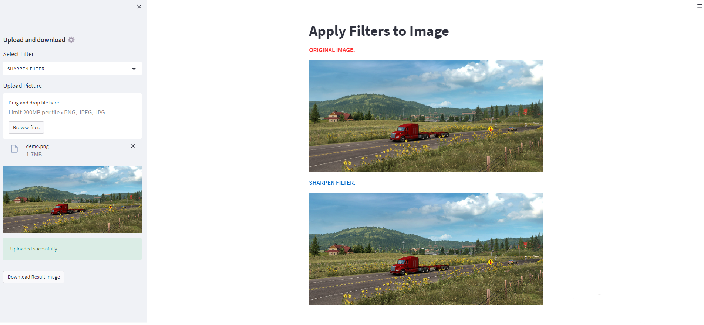
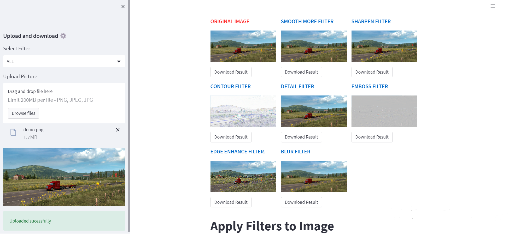

## Image Filters Webapp Based On Streamlit
Apply filters to your image using streamlit based webapp program


## Filters

- CONTOUR FILTER
- SMOOTH MORE FILTER
- SHARPEN FILTER
- EDGE ENHANCE MORE FILTER
- DETAIL FILTER
- EMBOSS FILTER
- BLUR FILTER
- ALL


## Deployment

Use python 3.8.15 version. Create virtual environment using anaconda. Conda version (4.12.0).

Create Virtual Environment:

```bash
  conda create --name py38 python==3.8
  conda activate py38
  pip install -r requirements.txt
```

Requirements:

```bash
  pip install streamlit-webrtc
  pip install streamlit
  pip install opencv-python
  pip install numpy
  pip install rembg
  pip install pillow
  pip install -r requirements.txt
```

How to Run:

```bash
streamlit run Image_filters.py
```
## Results
Sharpen Filter


Apply all filters at once
